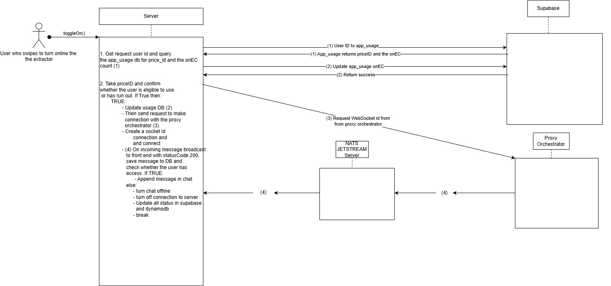
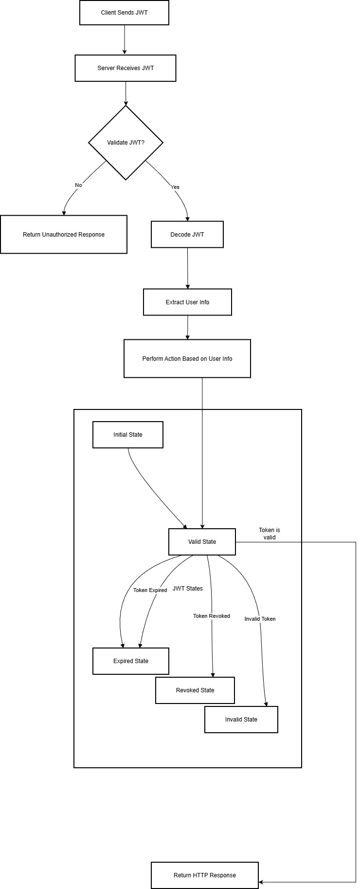
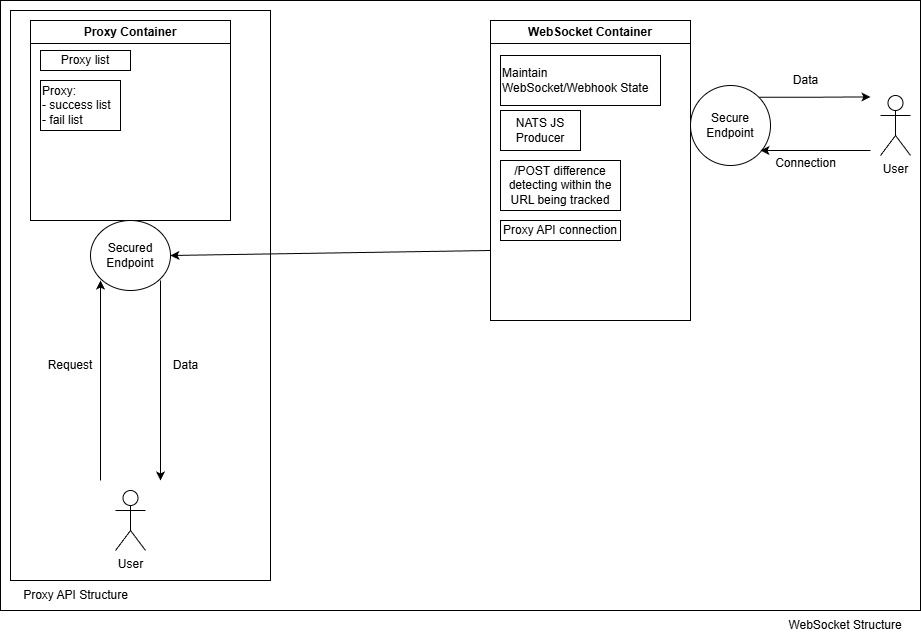
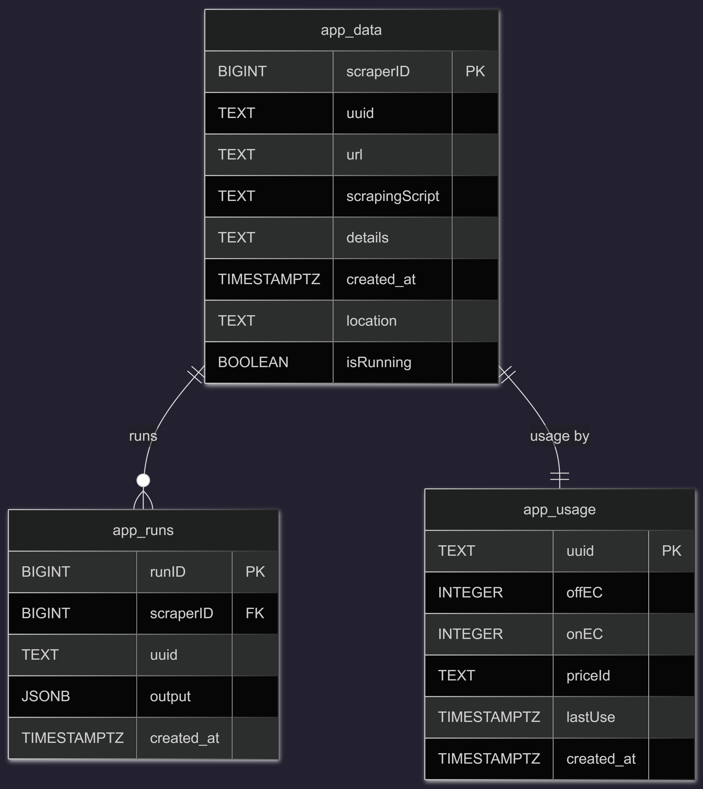
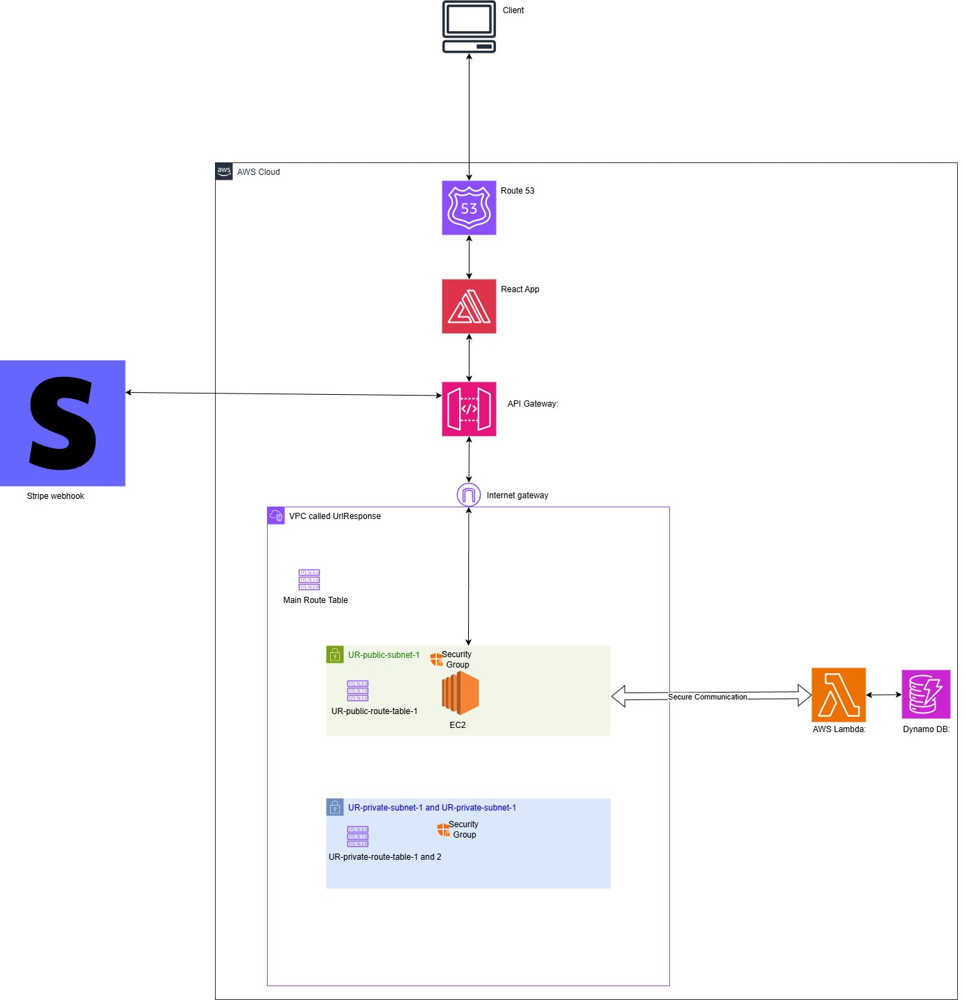

# What Did I Do

## AWS Amplify — Frontend

- **Tech Used**
  - **Styling & UI**
    - Tailwind CSS (v4.1.8) — utility-first CSS
    - DaisyUI (v5.0.43) — Tailwind component library
    - CSS3 — custom styles
  - **HTTP Client & API Integration**
    - Axios (v1.9.0) — HTTP client with interceptors
  - **UI Components & Icons**
    - Lucide React (v0.511.0) — icon library
    - React Switch (v7.1.0) — toggle components
  - **Core Framework & Language**
    - React (v19.1.0) — UI library
    - JavaScript (ES6+) — JSX, modules, async/await
    - React Hooks — `useState`, `useEffect`, custom hooks
  - **Build Tools & Development**
    - Vite (v6.3.5) — build tool and dev server
    - ESLint (v9.25.0) — linting
    - PostCSS (v8.5.4) — CSS processing
    - Autoprefixer (v10.4.21) — CSS vendor prefixes
  - **Routing & Navigation**
    - React Router DOM (v7.6.1) — client-side routing
  - **State Management**
    - Zustand (v5.0.5) — global state
  - **User Experience**
    - React Hot Toast (v2.5.2) — toast notifications
  - **Payment Integration**
    - Stripe.js (`@stripe/stripe-js` v7.4.0) — Stripe integration

## AWS EC2 — Backend  
*(Deployed in a secure subnet within a secure VPC, leveraging route tables with an API Gateway to keep a consistent domain name in the URL.)*

- **Backend**
  - WebSocket handler for online, live-data flowing connections, which remains online even after logging out and prints results when the user returns (WebSocket connections maintained by backend code)

  **Diagram: Online Extractor Toggle & WebSocket Flow**

  

    - Did not use NATS Jetstream or Apache Kafka because a server is required and a producer/consumer setup limits the amount of messages and connections, and does not work like a WebSocket connection (I still have experience trying these extensively to assess scalability and fit)
      - NATS Jetstream and Apache Kafka basically create a server and make producers and consumers; if code has a port and address to the server it communicates to it
  - Stripe webhook handler, where the events are forwarded to and handled
  - Node.js with Express router used in backend to route requests to appropriate endpoints for processing
  - Used SOLID principles and design patterns (structural, behavioural) for a simple, clean, and organized directory layout that allows me to rapidly locate faulty code with well-labeled errors
  - API Gateway using HTTPS to make a URL called `https://api.urlresponse.com` for clean routing and auth cookie functionality
  - Communicates with Supabase as well to track activity
  - **Tech Used**
    - **Core Backend Framework & Runtime**
      - Node.js — JavaScript runtime
      - Express.js (v5.1.0) — web framework
      - JavaScript (ES6+) — ES modules, async/await, modern syntax
    - **Database & Data Storage**
      - Supabase (`@supabase/supabase-js` v2.49.8) — PostgreSQL database and backend services
      - Valkey/Redis (`ioredis` v5.8.2) — in-memory cache and data store
    - **Authentication & Security**
      - **Diagram: JWT Validation & Token State Transitions**

        

      - JSON Web Tokens (JWT) (`jsonwebtoken` v9.0.2) — token-based authentication
      - `bcryptjs` (v3.0.2) — password hashing
      - Cookie Parser (v1.4.7) — cookie handling
    - **Payment Processing**
      - Stripe (v18.2.1) — payment processing and subscriptions with Stripe Webhooks for payment event handling
    - **HTTP Client & API Communication**
      - Axios (v1.9.0) — HTTP client for external APIs
    - **Real-time Communication**
      - WebSockets (`ws`)
    - **File & Media Management**
      - Cloudinary (v2.6.1) — cloud-based image/media management
    - **Utilities & Helpers**
      - UUID (v11.1.0) — unique identifier generation
    - **Process Management**
      - PM2 (`ecosystem.config.cjs`) — process manager for Node.js applications
    - **DevOps & Development Tools**
      - Nodemon (v3.1.10) — development auto-reload

- **Valkey (Redis-type server)**
  - To reduce hits to the backend, reduce latency of getting results, and minimize Supabase requests
  - Did not use the original Redis, as I don’t think it’s a stable product in terms of licensing

- **Automated proxy server** *(managed with PM2 since it is lighter than running a Docker container)*
  - Proxies ready to respond upon verified user request
  - Automatically refresh proxies
  - Automatically begins undetected chromedriver that is undetectable; modified on top of it to make it even more undetectable with proprietary methodology
    - Hint: I built a store of all the proxies that work, and their system info and browser info, and fine-tune the deployment to reflect a real system
  - Concurrently run *n* requests at the same time, handling race conditions
  - SQLite DB that stores the proxies locally for simple query latency
  - **Tech Used**
    - FastAPI (v0.116.1+) — async web framework
    - Uvicorn (v0.35.0+) — ASGI server
    - Pydantic (v2.11.7+) — data validation

  
  
- **Xvfb server (virtualizes the browser without having to display)**
  - Cannot do Amazon DCV Web Client since it will disconnect after maximum session duration is typically 12 hours; there may be periods where the app is not being used, then it will run into errors deploying a headed browser
  - XFCE or GNOME is not viable because I would need XFCE with a VNC (Apache Guacamole easiest to use) to make it work; too many moving parts and defeats the purpose of lightweight XFCE
  - XFCE does not work on Amazon Linux 2023 (which I’m using), and there is no point downgrading EC2 as support ends July 2026; so the only option if I want to take this route is GNOME
  - Did have to install packages for Google to run though
  - Xvfb uses less RAM than Amazon DCV Web Client and is plug-and-play for the headed chromedriver process within extracting

- **Architecture & Patterns**
  - RESTful API Design — REST endpoints
  - Microservices Architecture — separate Node.js and Python services
  - Middleware Pattern — authentication, validation middleware
  - Service Layer Pattern — business logic separation
  - WebSocket Real-time Communication — live data streaming
  - Caching Strategy — Redis/Valkey for performance
  - Error Handling — centralized error management
  - Environment-based Configuration — dev/staging/production configs
  - Subscription Management — recurring billing
  - CORS Configuration — cross-origin resource sharing
  - Cookie-based Authentication — secure session management
  - Webhook Processing — event-driven architecture

## AWS Lambda — Authentication/Authorization System  
*(Not dependent on Okta, Clerk, or any other authorization/authentication service.)*

- API Gateway using REST, with `x-api-key` used to verify requests and well-defined API routes
- Lambda interfaces with DynamoDB to act as the main storage for authentication and authorization
- To authenticate user: queries DynamoDB to determine if the user exists and provides a JWT token that expires and records timestamps
- To authorize user: queries DynamoDB to verify if a user with the same email exists or not on account creation request; handles authentication email process; verifies request; updates user subscription type

## AWS DynamoDB (NoSQL)

- Store the users with their unique user id
- Connected to AWS Lambda

## AWS Route 53

- Domain registrar
- Bought domain here and made SSL certificates

## Supabase (PostgreSQL)

**Diagram: Supabase Schema (app_data, app_usage, app_runs)**

- **Tables in DB (well-defined entity relational model)**
  - Multiple tables, including a table to track usage using a one-to-many cardinality ratio between the table with UUID and their extracts
- Avoided CRON jobs; preferred to perform methods when updating DB values to avoid race conditions (maintaining ACID)
- Built functionality to automatically reset a paid user’s usage monthly without running into race conditions

## GitLab

- Used to upload the project and work on it remotely
- Workflow: `git pull`, `git add .`, `git commit -m "Update Messages Here"`, then `git push`
  - No branch because I was the only one working on it
- GitLab runs a pipeline to verify commits

## Tax

- Personally filed correctly, using a T2Express license

# AWS Deployment Layout (End-to-End)

